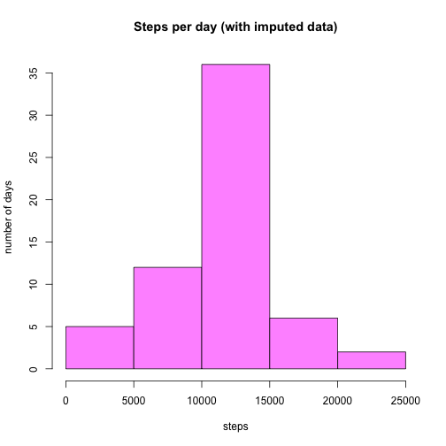
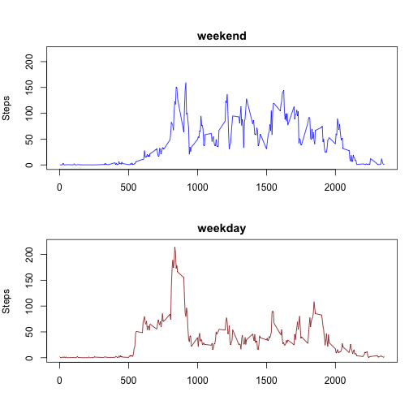

# Reproducible Research: Peer Assessment 1


## Loading and preprocessing the data
Task 1: mean and median total steps per day
------

#### Get averages by day

```r
setwd("/tmp/RepData_PeerAssessment1/")
steps <- read.csv("activity.csv")
stepdays <- tapply(steps$steps, steps$date, sum)
hist(stepdays, main = "Steps per day", xla = "steps", yla = "number of days")
```

 


## What is mean total number of steps taken per day?

#### Mean and median: 

```r
mean(stepdays, na.rm = T)
```

```
## [1] 10766
```

```r
median(stepdays, na.rm = T)
```

```
## [1] 10765
```


## What is the average daily activity pattern?

### Plot time series:

```r
stepmin <- aggregate(steps$steps, list(steps$interval), mean, na.rm = T)
names(stepmin) <- c("interval", "steps")
plot(stepmin$interval, stepmin$steps, type = "l")
```

 


### Get the interval with the most steps:

```r
stepmin[order(stepmin$steps), ][288, ]$interval
```

```
## [1] 835
```


## Imputing missing values

### number of missing data points:


```r
length(which(is.na(steps$steps)))
```

```
## [1] 2304
```


### steps ~ time model:


```r
# note: R incorrectly thinks the HHMM time is an integer, but we can work
# with that instead of having to convert.
steps$hour = floor(steps$interval/100)
steps$period = floor(steps$hour/3)
steps$period <- factor(steps$period)
levels(steps$period) <- c("0-2", "3-5", "6-8", "9-11", "12-14", "15-17", "18-20", 
    "21-23")
mod <- lm(steps ~ period, data = steps)
mod
```

```
## 
## Call:
## lm(formula = steps ~ period, data = steps)
## 
## Coefficients:
## (Intercept)    period3-5    period6-8   period9-11  period12-14  
##       0.478        4.018       84.397       49.732       47.519  
## period15-17  period18-20  period21-23  
##      56.669       47.006        5.895
```


Now imputing:


```r
steps$stepsi <- steps$steps
steps$stepsi[is.na(steps$steps)] <- predict(mod, newdata = steps[is.na(steps$steps), 
    ])
```


```r
stepdaysi <- tapply(steps$stepsi, steps$date, sum, na.rm = T)
stepdaysi
```

```
## 2012-10-01 2012-10-02 2012-10-03 2012-10-04 2012-10-05 2012-10-06 
##      10766        126      11352      12116      13294      15420 
## 2012-10-07 2012-10-08 2012-10-09 2012-10-10 2012-10-11 2012-10-12 
##      11015      10766      12811       9900      10304      17382 
## 2012-10-13 2012-10-14 2012-10-15 2012-10-16 2012-10-17 2012-10-18 
##      12426      15098      10139      15084      13452      10056 
## 2012-10-19 2012-10-20 2012-10-21 2012-10-22 2012-10-23 2012-10-24 
##      11829      10395       8821      13460       8918       8355 
## 2012-10-25 2012-10-26 2012-10-27 2012-10-28 2012-10-29 2012-10-30 
##       2492       6778      10119      11458       5018       9819 
## 2012-10-31 2012-11-01 2012-11-02 2012-11-03 2012-11-04 2012-11-05 
##      15414      10766      10600      10571      10766      10439 
## 2012-11-06 2012-11-07 2012-11-08 2012-11-09 2012-11-10 2012-11-11 
##       8334      12883       3219      10766      10766      12608 
## 2012-11-12 2012-11-13 2012-11-14 2012-11-15 2012-11-16 2012-11-17 
##      10765       7336      10766         41       5441      14339 
## 2012-11-18 2012-11-19 2012-11-20 2012-11-21 2012-11-22 2012-11-23 
##      15110       8841       4472      12787      20427      21194 
## 2012-11-24 2012-11-25 2012-11-26 2012-11-27 2012-11-28 2012-11-29 
##      14478      11834      11162      13646      10183       7047 
## 2012-11-30 
##      10766
```

```r
hist(stepdaysi, main = "Steps per day (with imputed data)", xla = "steps", yla = "number of days", 
    col = "#ff99ff")
```

 

*mean (with imputed data)*:

```r
mean(stepdaysi, na.rm = T)
```

```
## [1] 10766
```

*median  (with imputed data)*:

```r
median(stepdaysi, na.rm = T)
```

```
## [1] 10766
```


## Are there differences in activity patterns between weekdays and weekends?


```r
steps$ddate <- as.character(steps$date)
steps$ddate <- as.Date(steps$ddate, format = "%Y-%m-%d")
steps$weekday <- weekdays(steps$ddate)
steps$weekend <- F
steps$weekend[steps$weekday %in% c("Saturday", "Sunday")] <- T

stepmin.i.weekdays <- aggregate(steps$stepsi[!steps$weekend], list(steps$interval[!steps$weekend]), 
    mean, na.rm = T)
stepmin.i.weekends <- aggregate(steps$stepsi[steps$weekend], list(steps$interval[steps$weekend]), 
    mean, na.rm = T)
names(stepmin.i.weekdays) <- c("interval", "steps")
names(stepmin.i.weekends) <- c("interval", "steps")


par(mfrow = c(2, 1), mar = c(4, 4, 2, 1), oma = c(0, 0, 2, 0))
plot(stepmin.i.weekends$interval, stepmin.i.weekends$steps, pch = "", ylab = "Steps", 
    xlab = "", main = "weekend", type = "l", ylim = c(0, 220), col = "blue")
plot(stepmin.i.weekdays$interval, stepmin.i.weekdays$steps, pch = "", ylab = "Steps", 
    xlab = "", main = "weekday", type = "l", ylim = c(0, 220), col = "darkred")
```

 

